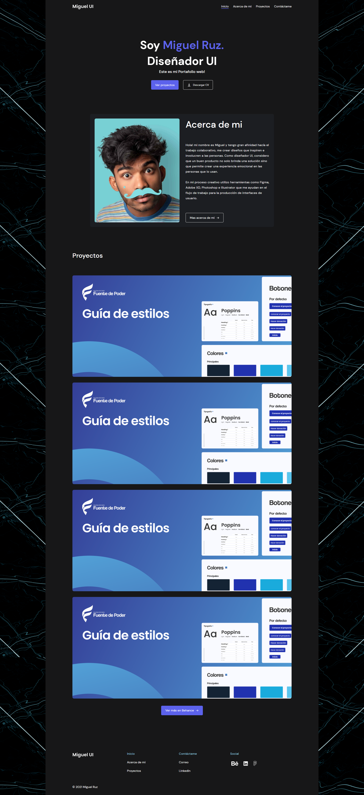
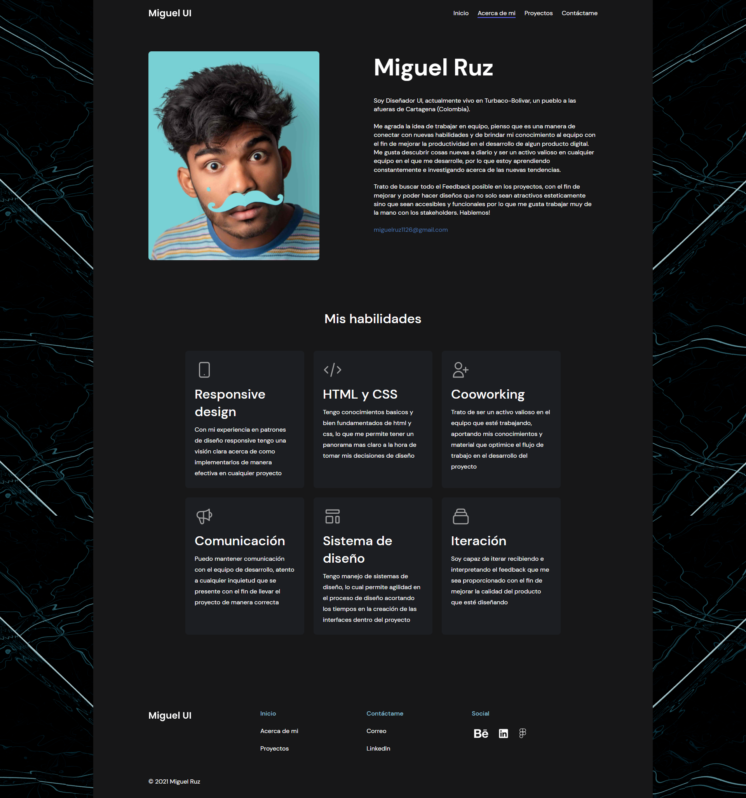
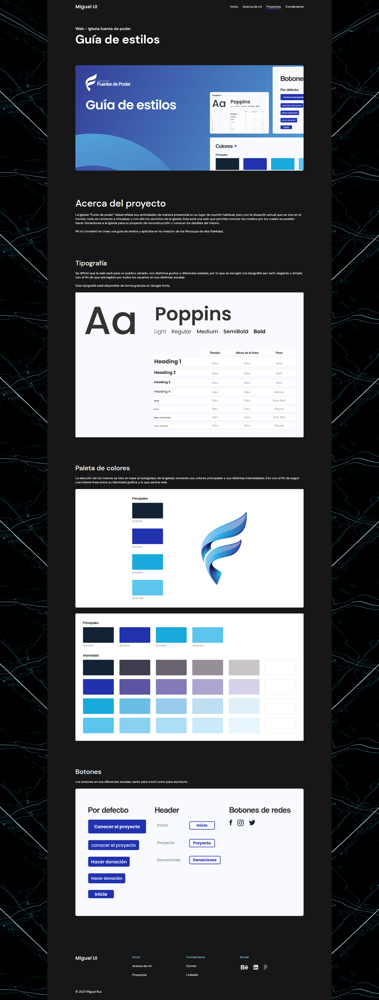
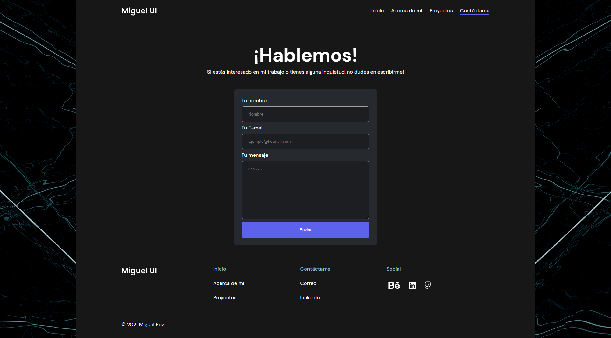

# UI Designer Portfolio (Made using React)

This is an example project for a UI designer Miguel Ruz Torres.

Project is based on designers Portfolio Template: [https://www.figma.com/community/file/1043975636941872336](https://www.figma.com/community/file/1043975636941872336).

Tools used to create this project: 
- React, 
- React Tostify, 
- React Hook Form, 
- React Router.

## Project Demonstration

Below you can see multiple images, showing how the website looks.

- **Main** Page:

- **About**  Page: 

- **Projects** Page:

- **Contacts** Page:

If you want to interact with this website, visit this link: [https://enver-react.netlify.app](https://enver-react.netlify.app)

If you need a developer for similar content, contact me via email: gfjankavs@tutamail.com
